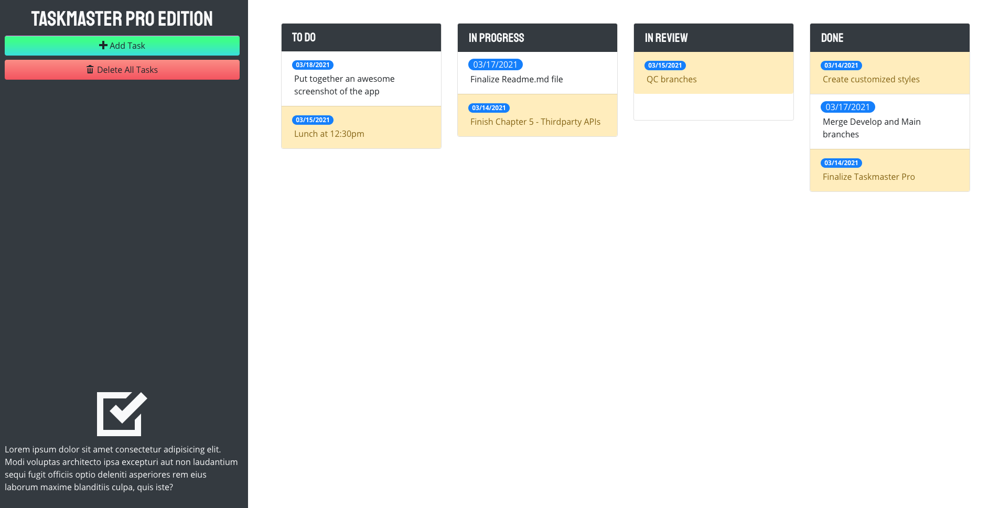

#TASKMASTER-PRO v2.0

## Description
Taskmaster-pro v2.0 is an updated version of Taskmaster-pro using JQuery, JQuery UI Bootstrap, Moment.JS, and other third-party API's via CDN. Legacy code was refactored to manipulate the DOM using jQuery, styled using bootstrap and custom styles to create responsive and advanced-UI design, interactive features were added using JQuery UI, simplified date and time functionality using MomentJS to account for immenent and past due dates and updated fonts using Google fonts CDN.

* Legacy code refactored to manipulate the DOM to add interactive functionality, loops, editing, adding and removing tasks

* Styled using Bootstrap and custom styles to create responsive design and customized branding

* Interactive Features added using JQuery UI

* Simplified date and time functionality in Javascript using MomentJS to account for immenent and past due dates

* SetIntervals to check if due dates are immenent or past due every 30 minutes

## Website
https://joshacross.github.io/taskmaster-pro/

## Reference Images

